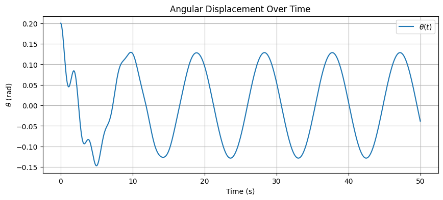
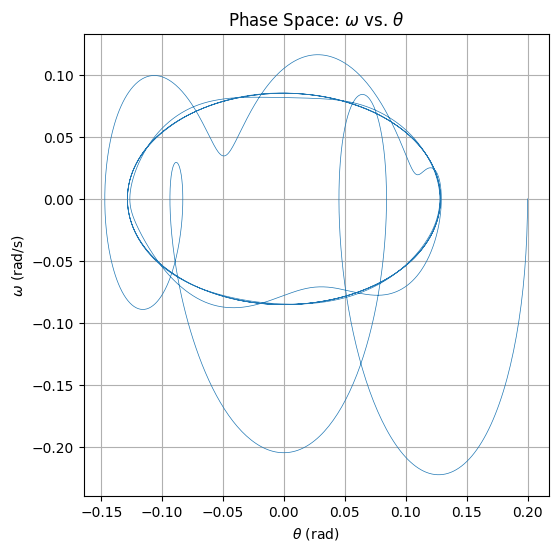
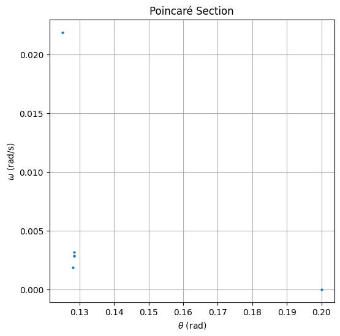

### 1. Theoretical Foundation

Start with the nonlinear differential equation describing the forced damped pendulum:

$$
\frac{d^2\theta}{dt^2} + b\frac{d\theta}{dt} + \frac{g}{L} \sin\theta = A \cos(\omega t)
$$
Where:

$$
\begin{aligned}
\theta & : \text{Angular displacement} \\
b & : \text{Damping coefficient} \\
g & : \text{Acceleration due to gravity} \\
L & : \text{Length of the pendulum} \\
A & : \text{Amplitude of the driving force} \\
\omega & : \text{Angular frequency of the driving force}
\end{aligned}
$$

#### Small-Angle Approximation

For small oscillations, approximate \( \sin\theta \approx \theta \). The equation becomes linear:

$$
\frac{d^2\theta}{dt^2} + b\frac{d\theta}{dt} + \frac{g}{L} \theta = A \cos(\omega t)
$$

This is a second-order **linear** nonhomogeneous differential equation with periodic forcing.

#### Resonance Conditions

The natural frequency of the pendulum (undamped, unforced) is:

$$
\omega_0 = \sqrt{\frac{g}{L}}
$$

Resonance occurs when the driving frequency \( \omega \) approaches the natural frequency:

$$
\omega \approx \omega_0
$$

At this point, the system exhibits **maximum amplitude** (resonant response), especially when damping is low.

---

### 2. Analysis of Dynamics

- Analyze how varying parameters affects behavior:
  - **Damping coefficient** $( b )$:Reduces amplitude and energy over time
  - **Driving amplitude** $( A )$:Controls how strongly the pendulum is forced
  - **Driving frequency** $( \omega )$:Determines synchronization, resonance, or chaos
  
  
 Regular to Chaotic Transition

 For some values of $( A )$and $( \omega )$, the system shifts from:

**Periodic motion**

**Quasiperiodic motion**

**Chaotic motion**

This transition is visualized using phase space plots and Poincaré sections.

### 3. Practical Applications

Discuss real-world systems that model a forced damped pendulum:

- **Energy harvesting** devices
- **Suspension bridges** under wind or vibration
- **Driven RLC circuits** in electronics
- **Biomechanical systems** like human gait

## 4.Implementation

We create a computational model to simulate the motion of a forced damped pendulum and visualize:

- Time evolution
- Phase diagram
- Poincaré section

