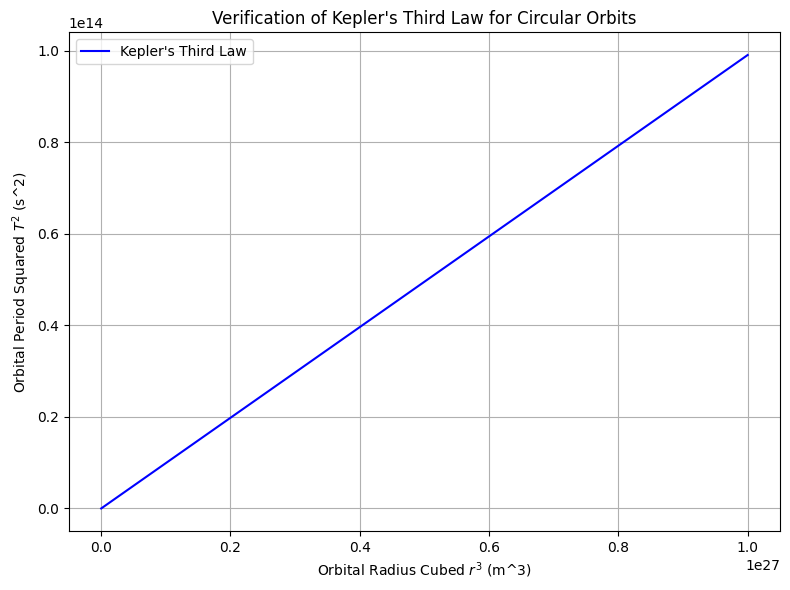

# Problem 1
### 1. Newton’s Law of Universal Gravitation

Newton’s Law of Universal Gravitation tells us the gravitational force between two masses M and m separated by a distance r is:

$$
F_{\text{gravity}} = \frac{G M m}{r^2}
$$

- \( G \) = Gravitational constant  
- \( M \) = Mass of central object  
- \( m \) = Orbiting mass  
- \( r \) = Orbital radius  

---

### 2. Centripetal Force for Circular Motion

An object moving in a circle must constantly be **accelerated toward the center** to keep changing its direction. This acceleration requires a force, known as **centripetal force**, given by:

$$
F_{\text{centripetal}} = \frac{m v^2}{r}
$$

---

### 3. Equating Forces

Since the gravitational force provides the centripetal force:

$$
\frac{G M m}{r^2} = \frac{m v^2}{r}
$$

Cancel \( m \) on both sides:

$$
\frac{G M}{r^2} = \frac{v^2}{r}
$$

Multiply both sides by \( r \):

$$
v^2 = \frac{G M}{r}
$$

---

### 4. Orbital Period Formula

Orbital period is the time to complete one full orbit:

$$
T = \frac{2\pi r}{v}
$$

Substitute $( v = \sqrt{\frac{G M}{r}} ):$

$$
T = \frac{2\pi r}{\sqrt{\frac{G M}{r}}}
= 2\pi \sqrt{\frac{r^3}{G M}}
$$

---

### 5. Final Form – Kepler’s Third Law

Squaring both sides:

$$
T^2 = \frac{4\pi^2}{G M} \cdot r^3
$$

This is **Kepler's Third Law** in mathematical form:

$$
T^2 \propto r^3
$$

---

### Computational Model
