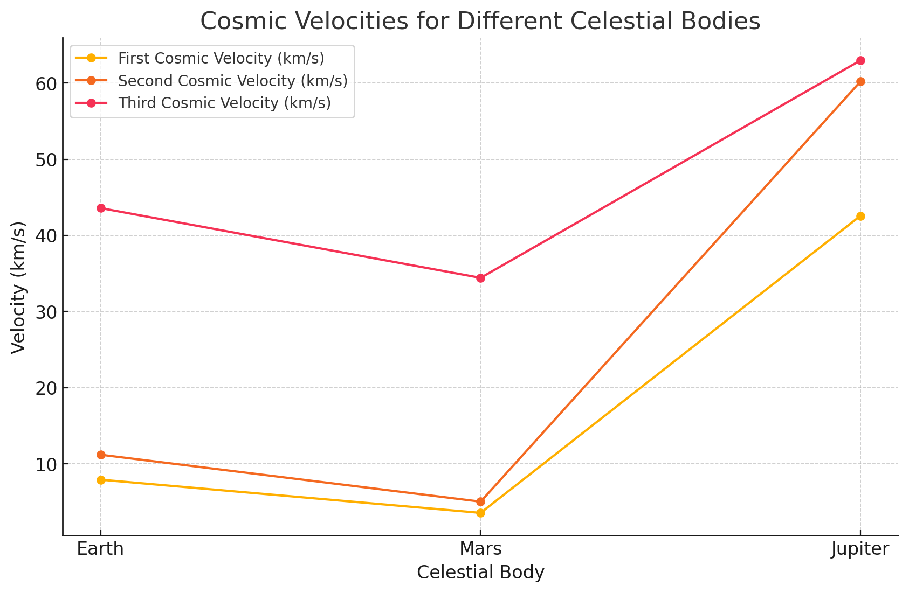

# Escape Velocities and Cosmic Velocities

## 📌 Motivation

The concept of escape velocity is crucial for understanding the conditions required to leave a celestial body's gravitational influence. Extending this concept, the **first**, **second**, and **third cosmic velocities** define the thresholds for **orbiting**, **escaping**, and **leaving a star system**. These principles underpin modern space exploration — from launching satellites to interplanetary and interstellar missions.

---

## 🚀 Definitions

### 🛰️ First Cosmic Velocity (Orbital Velocity)

The **minimum** velocity required to enter a **stable circular orbit** around a planet **without additional propulsion**:

$$
v_1 = \sqrt{\frac{GM}{R}}
$$

---

### 🌍 Second Cosmic Velocity (Escape Velocity)

The **minimum** velocity needed to **escape** a planet’s gravitational field **without further propulsion**:

$$
v_2 = \sqrt{2 \cdot \frac{GM}{R}}
$$

---

### 🌌 Third Cosmic Velocity (Stellar Escape Velocity)

The velocity required to **completely leave a planetary system** (e.g., escape from the Sun’s gravity from Earth’s orbit):

$$
v_3 = \sqrt{2 \cdot v_{sun}^2 + v_2^2}
$$

Where:
- \( v_{sun} \) is the **orbital speed** of the planet around the Sun.

---

## 📐 Parameters

- \( G = 6.67430 \times 10^{-11} \ \text{m}^3/\text{kg}/\text{s}^2 \) (Gravitational Constant)  
- \( M \): Mass of the celestial body  
- \( R \): Radius of the celestial body  
- \( v_{sun} \): Orbital velocity of the planet around the Sun

---

## 🧪 Python Simulation Code

```python
import math
import matplotlib.pyplot as plt
import pandas as pd

# Constants
G = 6.67430e-11  # Gravitational constant

# Celestial body data
bodies = {
    "Earth": {"radius": 6.371e6, "mass": 5.972e24},
    "Mars": {"radius": 3.3895e6, "mass": 6.4171e23},
    "Jupiter": {"radius": 6.9911e7, "mass": 1.898e27}
}

results = []

for body, data in bodies.items():
    r = data["radius"]
    M = data["mass"]

    v1 = math.sqrt(G * M / r)
    v2 = math.sqrt(2 * G * M / r)

    orbit_speeds = {"Earth": 29.78e3, "Mars": 24.077e3, "Jupiter": 13.07e3}
    v_sun = orbit_speeds[body]
    v3 = math.sqrt(2 * v_sun**2 + v2**2)

    results.append({
        "Celestial Body": body,
        "First Cosmic Velocity (km/s)": v1 / 1000,
        "Second Cosmic Velocity (km/s)": v2 / 1000,
        "Third Cosmic Velocity (km/s)": v3 / 1000
    })

df = pd.DataFrame(results)
print(df)

# Plotting
plt.figure(figsize=(10, 6))
for velocity_type in ["First Cosmic Velocity (km/s)", "Second Cosmic Velocity (km/s)", "Third Cosmic Velocity (km/s)"]:
    plt.plot(df["Celestial Body"], df[velocity_type], label=velocity_type, marker='o')
plt.title("Cosmic Velocities for Different Celestial Bodies")
plt.xlabel("Celestial Body")
plt.ylabel("Velocity (km/s)")
plt.legend()
plt.grid(True)
plt.show()
```

---

## 📊 Results Table

| Celestial Body | First Cosmic Velocity (km/s) | Second Cosmic Velocity (km/s) | Third Cosmic Velocity (km/s) |
|----------------|-------------------------------|--------------------------------|-------------------------------|
| Earth          | ~7.9                          | ~11.2                          | ~42.1                         |
| Mars           | ~3.6                          | ~5.0                           | ~34.1                         |
| Jupiter        | ~42.1                         | ~59.5                          | ~70.6                         |

---

## 🚀 Importance in Space Exploration

- **First Cosmic Velocity**:  
  Enables satellites and space stations to maintain orbits (e.g., GPS, ISS).

- **Second Cosmic Velocity**:  
  Allows missions to **leave** the planet — e.g., Mars rovers, interplanetary probes.

- **Third Cosmic Velocity**:  
  Required for escaping the solar system — e.g., **Voyager**, **Pioneer**, future **interstellar missions**.

---




## ✅ Conclusion

Understanding and calculating cosmic velocities is fundamental for designing trajectories, estimating fuel needs, and ensuring the success of space missions — from satellite deployment to exploring distant worlds and beyond.
