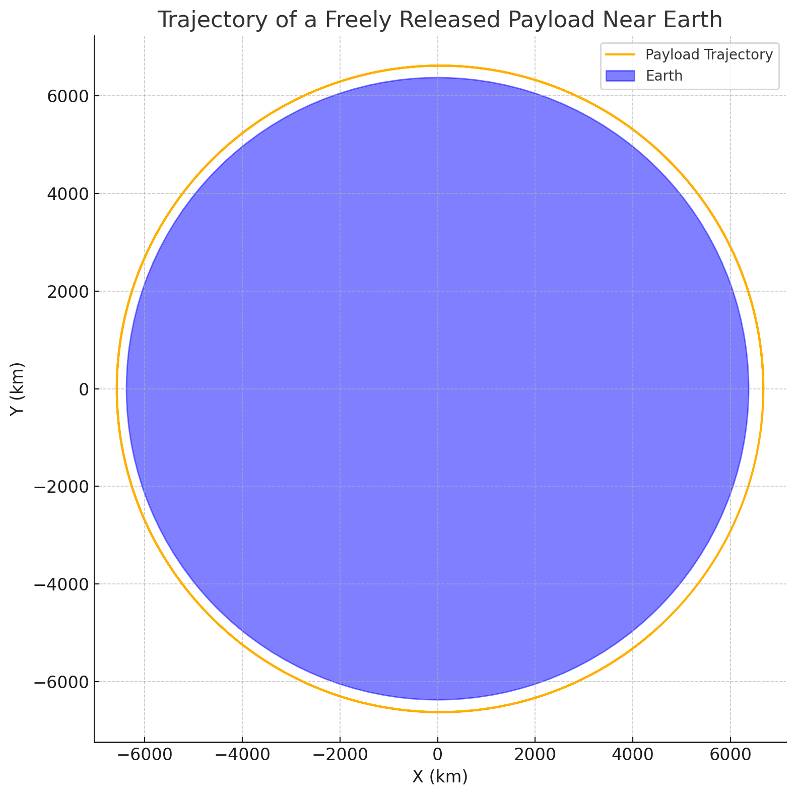
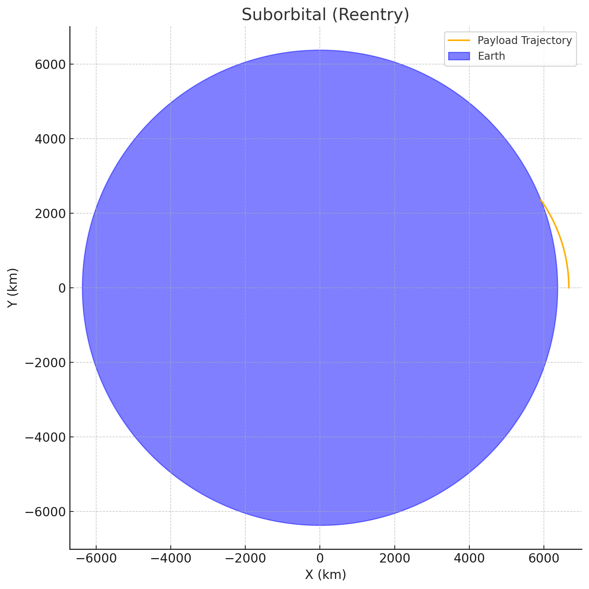
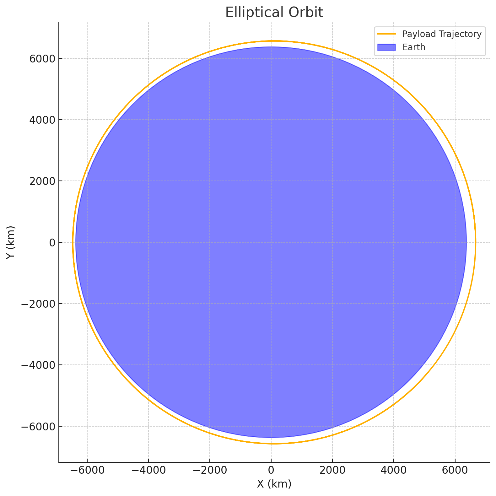
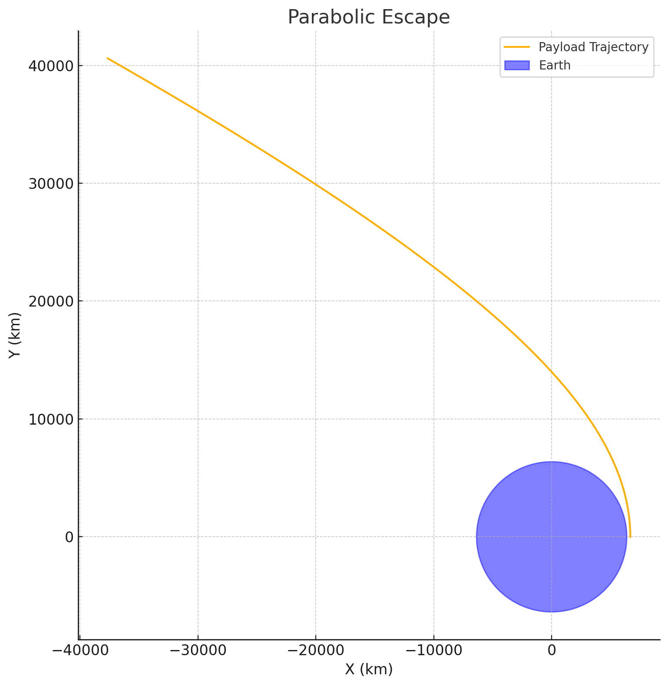
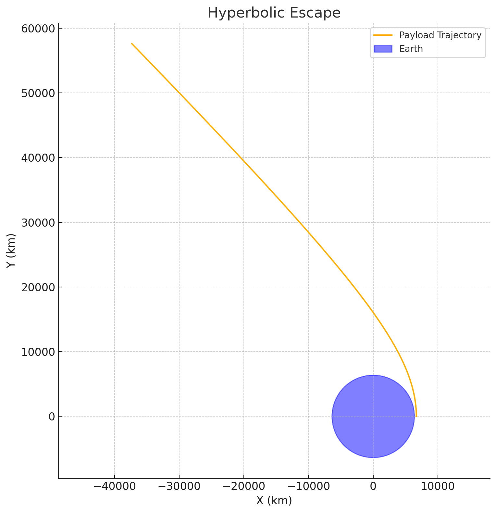

# Problem 3
# 🚀 Trajectories of a Freely Released Payload Near Earth

## 📌 Motivation

When an object is released from a moving rocket near Earth, its trajectory is governed by initial velocity, release angle, altitude, and the gravitational pull of Earth. This creates a spectrum of possible paths — **elliptical**, **parabolic**, or **hyperbolic** — depending on its **energy and direction**.

Understanding these trajectories is crucial for:

- **Orbital insertion**  
- **Satellite deployment**  
- **Reentry planning**  
- **Escape missions**  

---

## 🌍 Theoretical Background

### 🧲 Newton’s Law of Gravitation

$$
F = \frac{GMm}{r^2}
$$

Where:  
- \( F \) is the gravitational force  
- \( G = 6.67430 \times 10^{-11} \ \text{m}^3/\text{kg}/\text{s}^2 \)  
- \( M \) is Earth’s mass  
- \( m \) is the payload mass  
- \( r \) is the distance from Earth's center

---

### 🔄 Equation of Motion (2D)

To simulate motion in a plane, we use Newton's Second Law and integrate position and velocity:

$$
\vec{a} = - \frac{GM}{r^3} \vec{r}
$$

We use numerical methods like **Euler** or **Runge-Kutta (RK4)** to simulate the motion over time.

---

## ✨ Types of Trajectories

- **Elliptical**: Bound orbit (total mechanical energy < 0)
- **Parabolic**: Escape at exactly escape velocity (total energy = 0)
- **Hyperbolic**: Escape with excess velocity (total energy > 0)

The total specific energy:

$$
\epsilon = \frac{v^2}{2} - \frac{GM}{r}
$$

---

## 🧪 Python Simulation Code

```python
import numpy as np
import matplotlib.pyplot as plt

# Constants
G = 6.67430e-11
M = 5.972e24
R = 6.371e6  # Earth's radius in meters

# Initial conditions
altitude = 300e3  # 300 km above surface
r0 = np.array([R + altitude, 0])  # position vector
v0 = np.array([0, 7700])          # velocity vector (tangent speed near orbit)

# Time settings
dt = 1  # time step (s)
total_time = 10000  # seconds
steps = int(total_time / dt)

# Arrays to store trajectory
positions = []
velocities = []

r = r0.copy()
v = v0.copy()

for _ in range(steps):
    # Record position
    positions.append(r.copy())

    # Calculate acceleration
    distance = np.linalg.norm(r)
    acc = -G * M * r / distance**3

    # Update velocity and position (Euler method)
    v += acc * dt
    r += v * dt

    # Stop if impact
    if np.linalg.norm(r) <= R:
        break

positions = np.array(positions)

# Plot trajectory
plt.figure(figsize=(8, 8))
plt.plot(positions[:,0]/1000, positions[:,1]/1000, label="Payload Trajectory")
earth = plt.Circle((0, 0), R/1000, color='blue', alpha=0.5, label="Earth")
plt.gca().add_patch(earth)
plt.xlabel("X (km)")
plt.ylabel("Y (km)")
plt.title("Trajectory of a Freely Released Payload Near Earth")
plt.axis("equal")
plt.grid(True)
plt.legend()
plt.show()
```

---

## 🔍 Example Scenarios

| Scenario                          | Initial Speed (m/s) | Resulting Trajectory |
|----------------------------------|---------------------|----------------------|
| Below Orbital Speed (~7.5 km/s)  | 6000                | Sub-orbital / Reentry |
| Circular Orbit                   | 7670                | Elliptical Orbit      |
| Escape Velocity (~11.2 km/s)     | 11200               | Parabolic Escape      |
| Excess Velocity                  | 12000               | Hyperbolic Escape     |

---

## 📊 Visual Interpretation

- If the velocity is **too low**, the payload returns to Earth.
- If it's **just right**, it stays in orbit.
- If **too high**, it escapes Earth’s gravity.

---

## 🛰️ Applications

- **Satellite deployment**: Achieving elliptical or circular orbit
- **Space missions**: Transfer orbits to Moon, Mars, etc.
- **Reentry planning**: Ensuring objects return predictably
- **Planetary science**: Studying how objects behave near planetary bodies

---
  
 

 














## ✅ Conclusion

Simulating payload trajectories near Earth highlights the beauty and complexity of **celestial mechanics**. Even slight changes in initial speed or angle drastically affect the path — making simulation tools and understanding physics absolutely vital for modern space missions.

---

