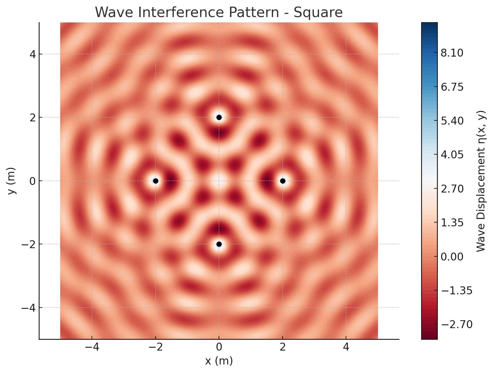
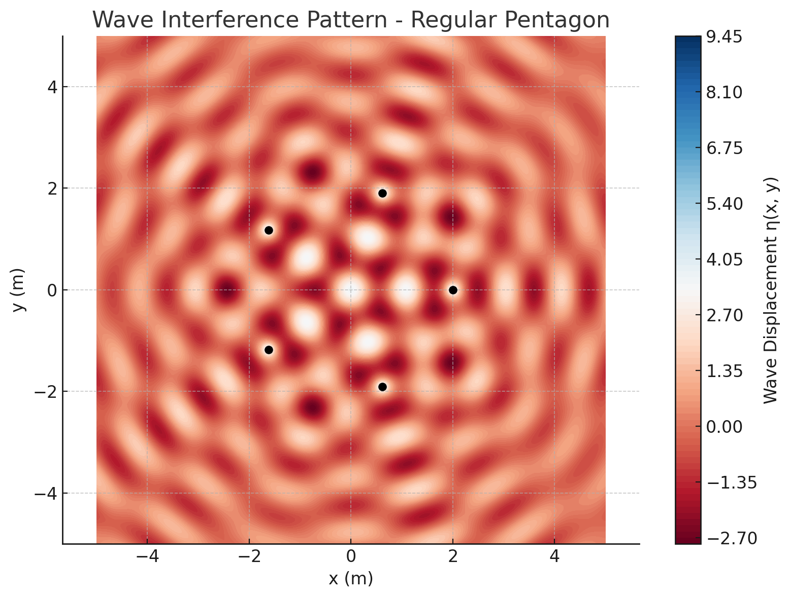

# 🌊 Interference Patterns on a Water Surface

## 🎯 Motivation

Interference occurs when waves from different sources overlap. On a water surface, this is easily observed when ripples from multiple points meet, forming distinctive interference patterns. These patterns demonstrate how waves combine through **constructive interference** (amplifying) and **destructive interference** (canceling out).

Studying interference patterns helps us:
- Understand wave behavior in a visual, intuitive way.
- Explore wave superposition and the effects of source geometry.
- Apply core physics concepts to real-world systems like sonar, optics, and wireless communication.

---

## 📘 Theoretical Foundation

### ✅ Single Disturbance Wave Equation

A circular wave from a point source located at $(x_0, y_0)$ is described by:

$$
\eta(x, y, t) = \frac{A}{\sqrt{r}} \cdot \cos(kr - \omega t + \phi)
$$

Where:
- $\eta(x, y, t)$: water surface displacement at position $(x, y)$ and time $t$
- $A$: amplitude of the wave  
- $k = \frac{2\pi}{\lambda}$: wave number ($\lambda$ = wavelength)  
- $\omega = 2\pi f$: angular frequency ($f$ = frequency)  
- $r = \sqrt{(x - x_0)^2 + (y - y_0)^2}$: distance from the source  
- $\phi$: initial phase

---

### ✅ Superposition Principle

When multiple sources emit waves, the total displacement is the **sum of individual displacements**:

$$
\eta_{\text{sum}}(x, y, t) = \sum_{i=1}^{N} \eta_i(x, y, t)
$$

Where $N$ is the number of sources. All sources are assumed coherent and have the same amplitude, wavelength, and frequency.

---

## 🧪 Python Simulation

```python
import numpy as np
import matplotlib.pyplot as plt

# Wave parameters
A = 1.0
wavelength = 1.0
frequency = 1.0
omega = 2 * np.pi * frequency
k = 2 * np.pi / wavelength
phi = 0.0
t = 0.0  # fixed time snapshot

# Grid definition
x = np.linspace(-5, 5, 400)
y = np.linspace(-5, 5, 400)
X, Y = np.meshgrid(x, y)

# Regular polygon vertices
def regular_polygon_vertices(n, radius=2.0, center=(0, 0)):
    return [
        (
            center[0] + radius * np.cos(2 * np.pi * i / n),
            center[1] + radius * np.sin(2 * np.pi * i / n)
        )
        for i in range(n)
    ]

# Single source wave
def single_wave(x, y, x0, y0, t, A, k, omega, phi):
    r = np.sqrt((x - x0)**2 + (y - y0)**2)
    return A / np.sqrt(r + 1e-6) * np.cos(k * r - omega * t + phi)

# Simulation function
def simulate_interference_pattern(n_sources, title="Polygon Interference Pattern", radius=2.0, t=0.0):
    sources = regular_polygon_vertices(n=n_sources, radius=radius)
    eta_total = np.zeros_like(X)
    for (x0, y0) in sources:
        eta_total += single_wave(X, Y, x0, y0, t, A, k, omega, phi)

    plt.figure(figsize=(8, 6))
    plt.contourf(X, Y, eta_total, levels=100, cmap='RdBu')
    plt.colorbar(label='Wave Displacement η(x, y)')
    for sx, sy in sources:
        plt.plot(sx, sy, 'ko')
    plt.title(f'Wave Interference Pattern - {title}')
    plt.xlabel('x (m)')
    plt.ylabel('y (m)')
    plt.axis('equal')
    plt.grid(True)
    plt.tight_layout()
    plt.show()

# Run simulations
simulate_interference_pattern(n_sources=3, title="Equilateral Triangle")
simulate_interference_pattern(n_sources=4, title="Square")
simulate_interference_pattern(n_sources=5, title="Regular Pentagon")
```

---

## 📊 Results & Analysis

### 🔺 Equilateral Triangle
- Symmetrical three-source setup.
- Interference peaks form between each pair of sources.

### ◼️ Square
- More complex grid-like pattern.
- Strong central interference and diagonal symmetry.

### 🔷 Pentagon
- Five-source symmetry creates rich and dense interference zones.
- Sharp wavefront overlaps near center.

---






## 🎯 Key Observations

- More sources $\Rightarrow$ more intricate interference.
- Geometry of sources (polygon type) dictates pattern symmetry.
- Constructive interference $\Rightarrow$ high-displacement zones.
- Destructive interference $\Rightarrow$ null displacement regions.

---

## ✅ Deliverables Summary

1. ✅ **Python simulation** for point sources placed in regular polygons  
2. ✅ **Mathematical derivation** of wave equations  
3. ✅ **Graphical results** showing interference regions  
4. ✅ Clear explanation of **wave superposition** and pattern formation

---

