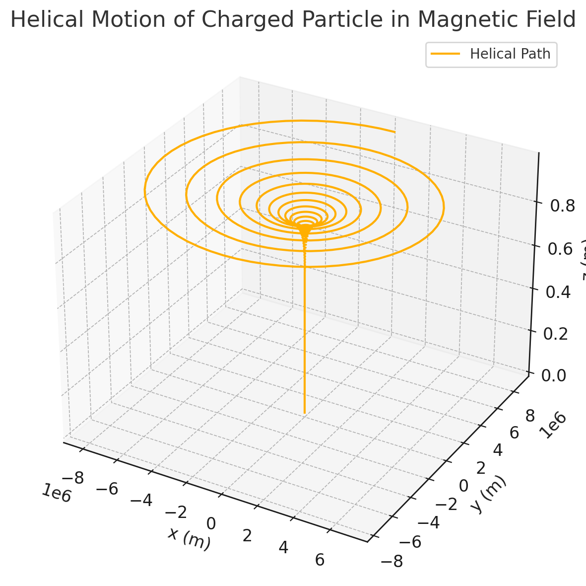

# ⚛️ Simulating the Effects of the Lorentz Force

## 🎯 Motivation

The **Lorentz Force** describes how electric and magnetic fields influence the motion of charged particles:

$$
\vec{F} = q \vec{E} + q \vec{v} \times \vec{B}
$$

This force is fundamental in:

- Particle accelerators  
- Mass spectrometers  
- Magnetic/electric confinement (fusion)  
- Plasma and astrophysics

---

## 📘 Physics Background

Using Newton’s Second Law:

$$
\vec{F} = m \vec{a} \quad \Rightarrow \quad \vec{a} = \frac{q}{m} \left( \vec{E} + \vec{v} \times \vec{B} \right)
$$

We integrate numerically (Euler method):

- $\vec{v}_{t+\Delta t} = \vec{v}_t + \vec{a} \cdot \Delta t$  
- $\vec{r}_{t+\Delta t} = \vec{r}_t + \vec{v}_{t+\Delta t} \cdot \Delta t$

---

## 1️⃣ Circular Motion in a Magnetic Field

### Initial Conditions

- $\vec{v} \perp \vec{B}$  
- $\vec{E} = 0$  
- Particle: Proton

### Expected Result

Circular motion in the plane perpendicular to $\vec{B}$ with radius:

$$
r = \frac{m v}{q B}
$$

### Python Code Snippet

```python
v0 = np.array([1e5, 0, 0])
B = np.array([0, 0, 1])
E = np.array([0, 0, 0])
```

🌀 **Result**: The proton undergoes circular motion with constant speed due to the magnetic Lorentz force acting as centripetal force.

---

## 2️⃣ Helical Motion

### Initial Conditions

- $\vec{v} = v_\perp \, \hat{x} + v_\parallel \, \hat{z}$  
- $\vec{E} = 0$  
- $\vec{B} = B \, \hat{z}$

### Explanation

- $\vec{v}_\perp$ causes circular motion in x-y plane  
- $\vec{v}_\parallel$ causes uniform linear motion in z-direction  
- The result is a **helix**

### Helical Pitch

$$
p = v_\parallel \cdot T = v_\parallel \cdot \frac{2\pi m}{q B}
$$

---

###3️⃣ $\vec{E} \times \vec{B}$ Drift

### Conditions

- $\vec{E} \perp \vec{B}$  
- $\vec{v}_0 = 0$

### Drift Velocity

$$
\vec{v}_{\text{drift}} = \frac{\vec{E} \times \vec{B}}{B^2}
$$

### Characteristics

- Constant drift regardless of $q$ or $m$  
- Direction of motion is given by right-hand rule for $\vec{E} \times \vec{B}$  
- Important in plasma confinement and space propulsion

---

## 💡 Summary of Trajectories

| Scenario         | Field Configuration                  | Motion Type     |
|------------------|--------------------------------------|------------------|
| Magnetic Only     | $\vec{v} \perp \vec{B}$              | Circular         |
| Magnetic Only     | $\vec{v}_\perp + \vec{v}_\parallel$  | Helical          |
| Crossed Fields    | $\vec{E} \perp \vec{B}$              | Linear Drift     |

---





## ✅ Conclusions

- Lorentz force shapes how charged particles move in electromagnetic fields
- Motion depends on orientation of $\vec{v}$ with respect to $\vec{E}$ and $\vec{B}$
- Applications: cyclotrons, Hall effect, space thrusters, fusion

---

## 🧾 Deliverables Checklist

- ✅ Circular motion simulation  
- ✅ Helical motion simulation  
- ✅ $\vec{E} \times \vec{B}$ drift simulation  
- ✅ Clear derivations and equations  
- ✅ Trajectory visualizations and real-world applications

---

