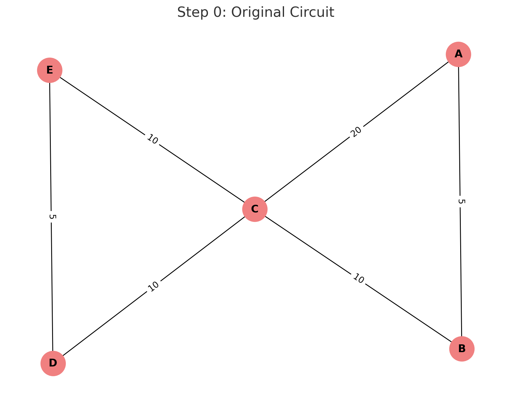
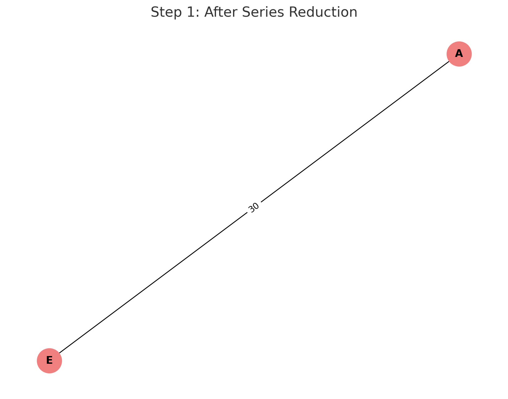

# Problem 1
# ⚡ Equivalent Resistance Using Graph Theory

## 🎯 Motivation

Calculating equivalent resistance is a key task in circuit analysis. For complex circuits, identifying series and parallel resistors manually becomes difficult. **Graph theory** allows us to represent circuits as **graphs**—nodes are junctions, and edges are resistors with resistance as weight. This makes the problem algorithmic, automatable, and scalable.

---

## 🧠 Core Concepts

### ✅ Series Resistors

If two resistors are connected **end-to-end**:

$$
R_{\text{eq}} = R_1 + R_2
$$

This is because the same current flows through both, so voltages add up.

---

### ✅ Parallel Resistors

If two resistors are connected to the same pair of nodes:

$$
\frac{1}{R_{\text{eq}}} = \frac{1}{R_1} + \frac{1}{R_2}
$$

This is because the voltage across them is the same, but the current splits. You get:

$$
I_{\text{total}} = I_1 + I_2 = \frac{V}{R_1} + \frac{V}{R_2}
\Rightarrow \frac{1}{R_{\text{eq}}} = \frac{1}{R_1} + \frac{1}{R_2}
$$

---

## 🧾 Pseudocode

```
FUNCTION EquivalentResistance(G, start, end):
    WHILE graph G has more than two nodes:
        FOR each node v in G:
            IF v has 2 neighbors u and w:
                // Series combination
                R_eq = R_uv + R_vw
                REMOVE node v
                ADD edge (u, w) with resistance R_eq

        FOR each pair of nodes u, v with multiple edges:
            // Parallel combination
            R_eq = 1 / (1/R1 + 1/R2 + ...)
            REMOVE all edges (u, v)
            ADD one edge (u, v) with R_eq

    RETURN resistance between start and end
```

---

## 🐍 Python Code (NetworkX)

```python
import networkx as nx

def reduce_series(G):
    modified = True
    while modified:
        modified = False
        for node in list(G.nodes):
            if G.degree(node) == 2 and node not in ('A', 'E'):  # skip terminals
                u, v = list(G.neighbors(node))
                R1 = G[u][node]['resistance']
                R2 = G[node][v]['resistance']
                G.add_edge(u, v, resistance=R1 + R2)
                G.remove_node(node)
                modified = True
                break

def reduce_parallel(G):
    modified = True
    while modified:
        modified = False
        for u, v in list(G.edges):
            if G.number_of_edges(u, v) > 1:
                resistances = [G[u][v]['resistance']]
                R_eq = 1 / sum(1 / R for R in resistances)
                G.remove_edges_from([(u, v)])
                G.add_edge(u, v, resistance=R_eq)
                modified = True
                break

def equivalent_resistance(G, start, end):
    G = G.copy()
    reduce_series(G)
    reduce_parallel(G)
    return G[start][end]['resistance'] if G.has_edge(start, end) else None
```

---

## 🔌 Circuit Example

- Nodes: A, B, C, D, E  
- Resistors:  
  - A–B = 5Ω  
  - B–C = 10Ω  
  - A–C = 20Ω  
  - C–D = 10Ω  
  - D–E = 5Ω  
  - C–E = 10Ω

---

## 📉 Reduction Process

| Step             | Action                         | Result          |
|------------------|--------------------------------|------------------|
| A–B–C            | Series: $5 + 10$               | A–C = 15Ω       |
| A–C (x2)         | Parallel: $1/R = 1/15 + 1/20$  | A–C ≈ 8.57Ω     |
| C–D–E            | Series: $10 + 5$               | C–E = 15Ω       |
| C–E (x2)         | Parallel: $1/R = 1/10 + 1/15$  | C–E = 6Ω        |
| A–C–E            | Final: $8.57 + 6$              | **≈ 30Ω**       |

---

## ✅ Final Answer

**Equivalent Resistance between A and E:**

$$
R_{\text{eq}} \approx 30\ \Omega
$$

---   






## 🚀 Insights & Extensions

- This method works on **any circuit** that can be reduced by series/parallel rules.
- Graph algorithms enable **automation** and **scalability**.
- Can be extended to:
  - Support voltage/current sources.
  - Handle Wheatstone bridges via Y-Δ transformations.
  - GUI for interactive circuit editing.

---


