# Problem 1
# 📊 Exploring the Central Limit Theorem through Simulations

## 🎯 Motivation

The **Central Limit Theorem (CLT)** is a foundational concept in statistics. It states:

> Given a sufficiently large sample size $n$, the sampling distribution of the sample mean will approximate a **normal distribution** — even if the underlying population distribution is not normal.

This is essential in:
- Parameter estimation  
- Quality control  
- Predictive modeling  
- Statistical inference  

---

## 🔢 Simulation Setup

We simulate CLT using three different population distributions:

1. **Uniform(0, 1)** — Flat distribution  
2. **Exponential(λ = 1)** — Skewed distribution  
3. **Binomial(n = 10, p = 0.5)** — Discrete distribution  

For each population:
- Generate $100,\!000$ values  
- Draw $1,\!000$ random samples for each $n \in \{5, 10, 30, 50\}$  
- Compute the **sample mean**  
- Plot the distribution of those means  

---

## 🧪 Python Code Snippet

```python
def simulate_sampling_distribution(population_func, pop_args, sample_sizes, n_samples=1000, pop_size=100000):
    population = population_func(*pop_args, size=pop_size)
    results = {}
    for n in sample_sizes:
        sample_means = [
            np.mean(np.random.choice(population, size=n, replace=True))
            for _ in range(n_samples)
        ]
        results[n] = sample_means
    return population, results
```

---

## 📈 Results and Visualization

For each distribution, observe how the histogram of **sample means** changes as sample size increases.

✅ Even if the population is **not normal**, the sampling distribution **approaches a normal shape** as $n$ increases.

---

## 🔍 Parameter Exploration

- **Sample size ($n$):**  
  - Small $n$: sample means retain some skew/noise  
  - Larger $n$: bell-shaped normal distribution emerges  

- **Population shape:**  
  - The more skewed the population, the **larger $n$ needed** to approximate normality  

- **Variance:**  
  - The spread of the sampling distribution **decreases** as $n$ increases  
  - Theoretical variance of sample mean:  
    $$
    \text{Var}(\bar{X}) = \frac{\sigma^2}{n}
    $$

---

## 🌍 Real-World Applications of CLT

- **Estimating population means** from samples (e.g., average income, political polling)  
- **Quality control:** sample averages are used to monitor manufacturing processes  
- **Finance:** average returns over time modeled as normally distributed  
- **Medical studies:** comparing averages in clinical trials, lab testing  

---


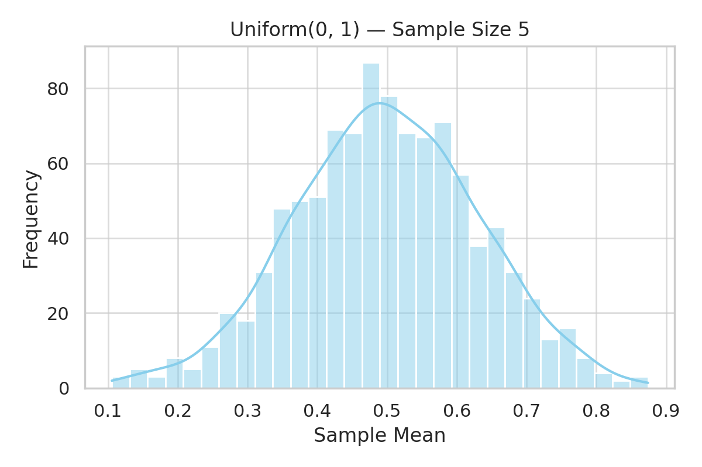

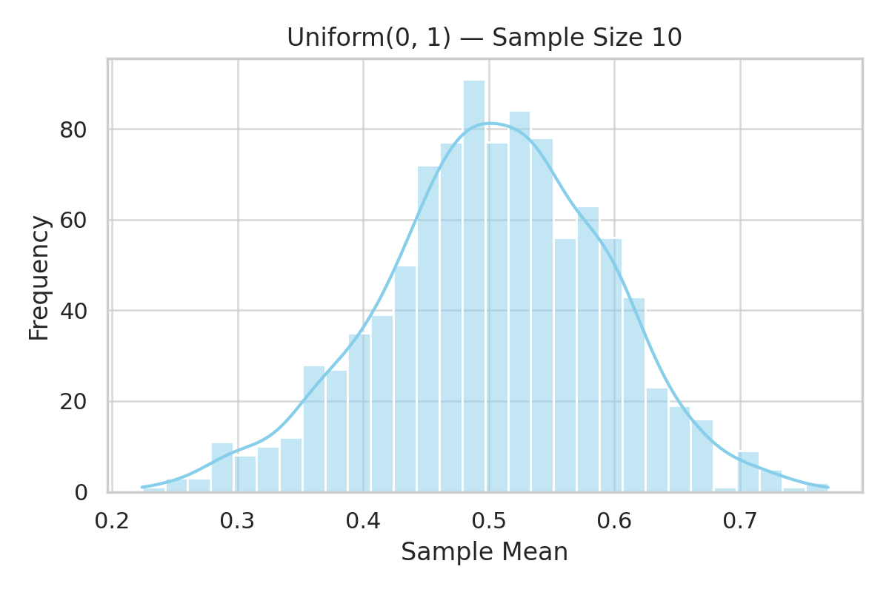

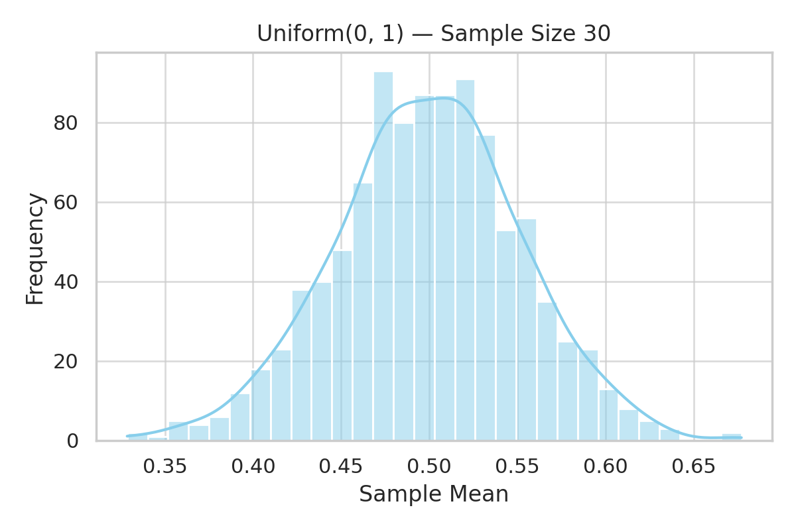

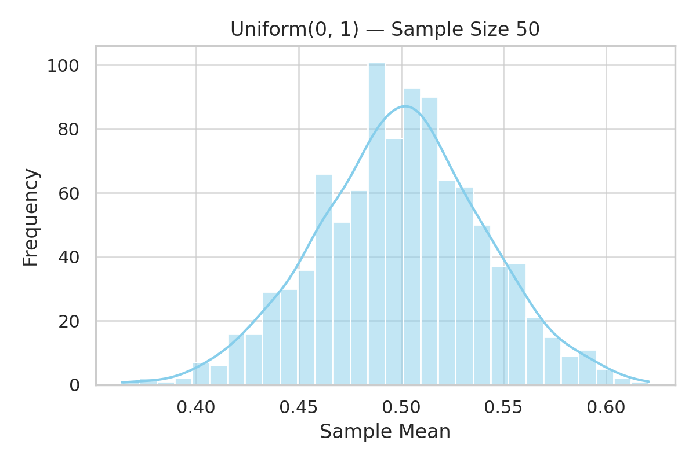


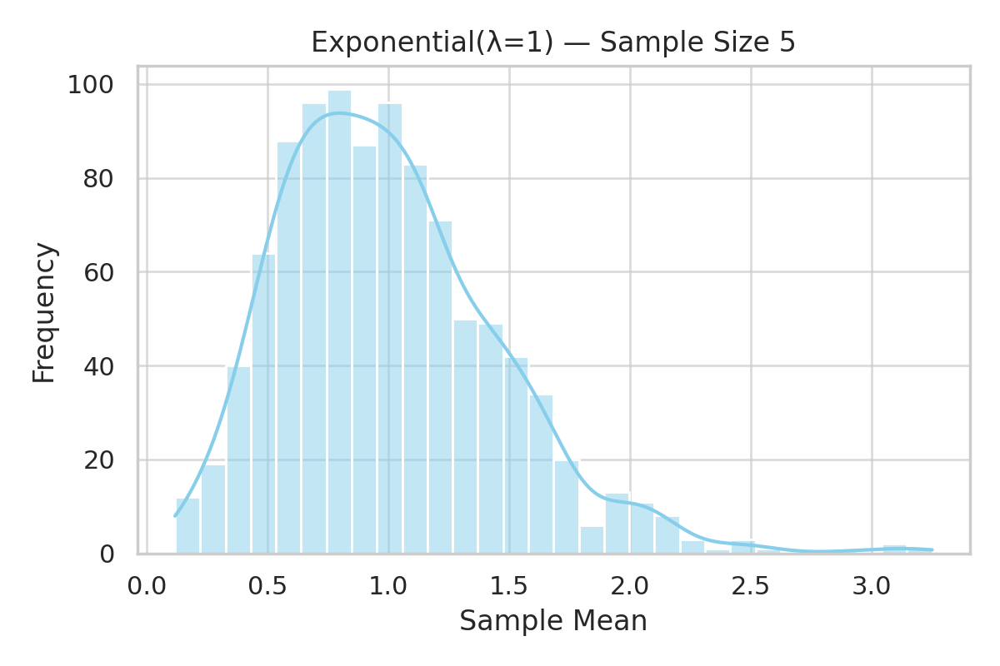

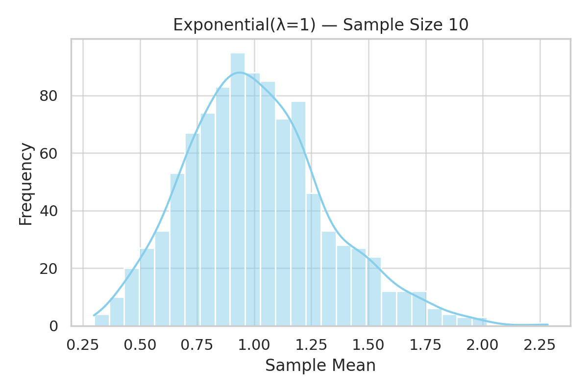

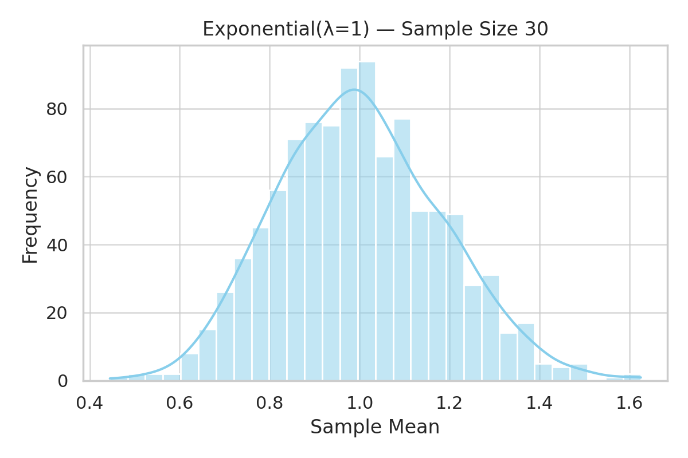

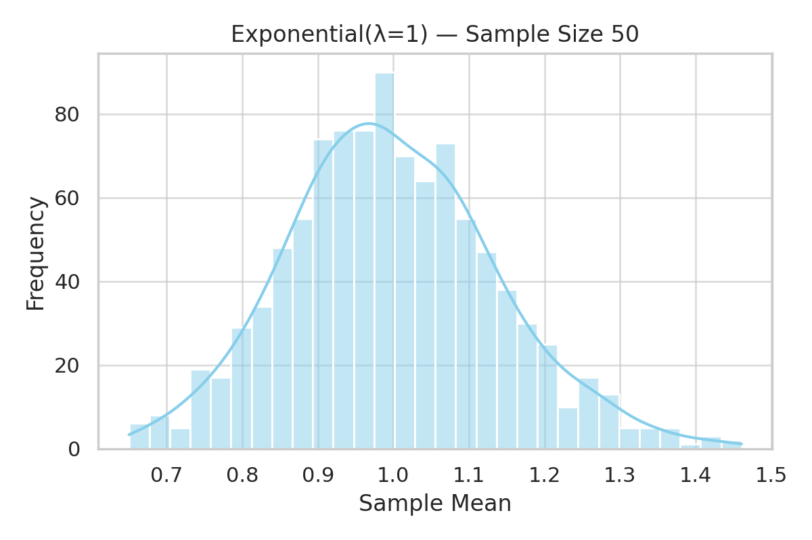

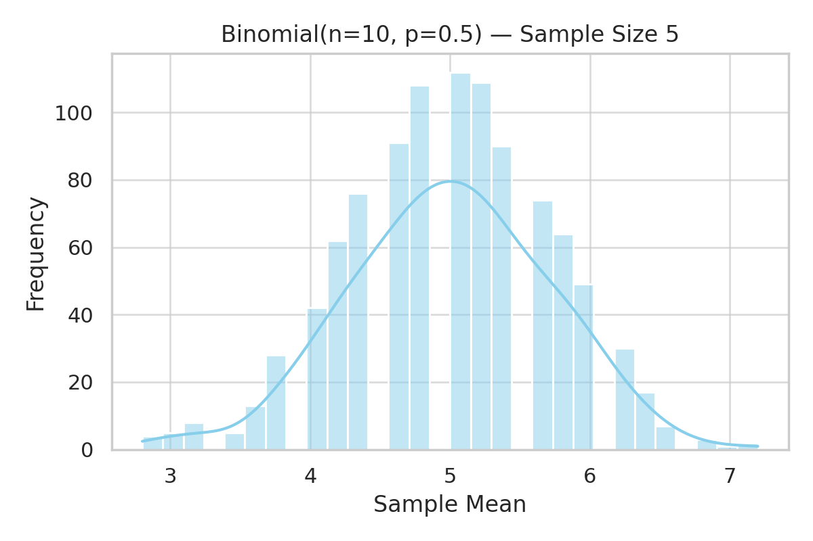

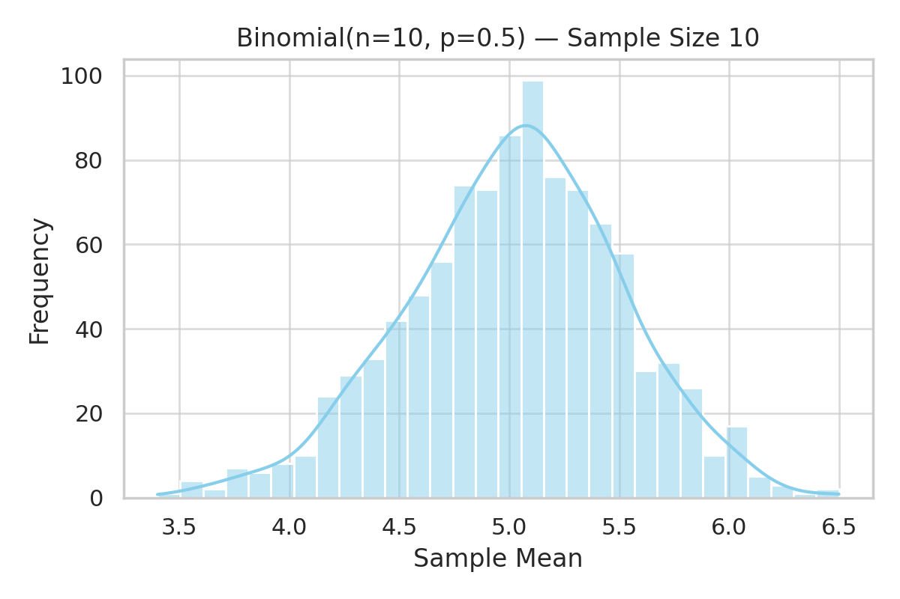

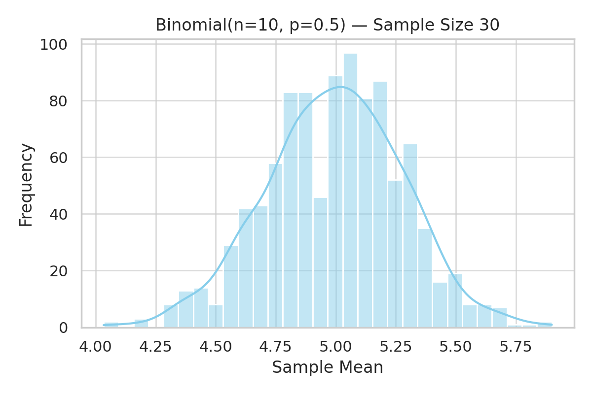

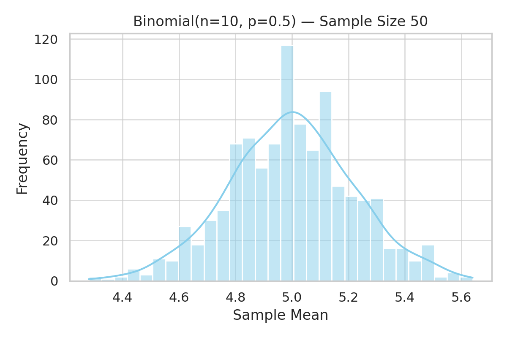

## ✅ Conclusion

The CLT shows the **power of averages** — it allows statisticians to make inferences about populations using samples, even when the population distribution is unknown.

Through simulation, we:
- Verified convergence of sample means to a normal distribution  
- Illustrated how sample size affects this convergence  
- Connected this theory to practical scenarios  

---

## 📌 Deliverables

- ✅ Simulations for Uniform, Exponential, and Binomial populations  
- ✅ Histograms for $n = 5, 10, 30, 50$  
- ✅ Code and derivations  
- ✅ Real-world applications explained  

