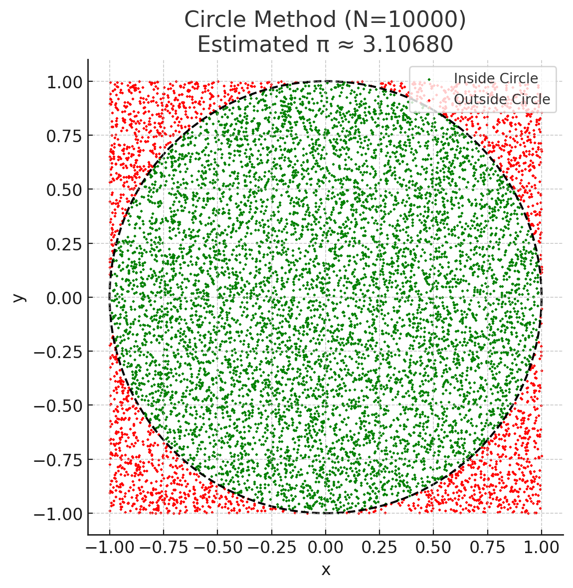
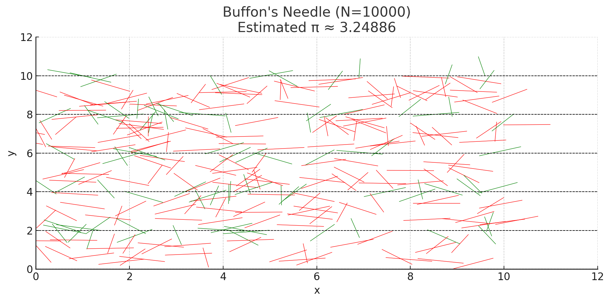
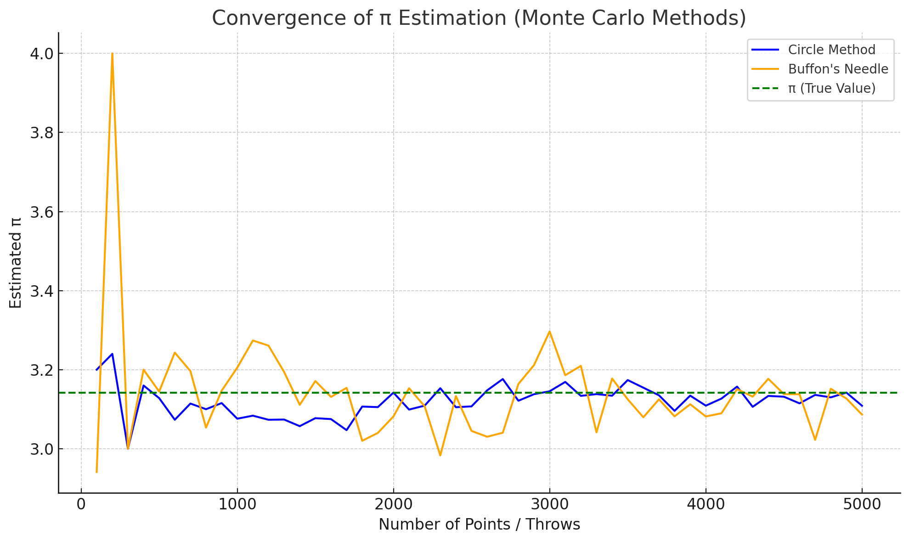

# Problem 2
# 🎯 Estimating $\pi$ using Monte Carlo Methods

## 📘 Motivation

Monte Carlo simulations are computational techniques using randomness to solve problems. One famous use: estimating $\pi$ via geometric probability. By generating random points or dropping virtual needles and checking how often they satisfy geometric conditions, we can approximate $\pi$ in a simple, visual way.

---

# 🧮 PART 1: Estimating $\pi$ Using a Circle

## 1️⃣ Theoretical Foundation

Imagine a **unit circle** (radius $r = 1$) inside a square of side length 2:

- Area of square: $4$
- Area of circle: $\pi$

So, if we randomly throw points in the square, the ratio inside the circle approximates:

$$
\frac{\text{Points inside circle}}{\text{Total points}} \approx \frac{\pi}{4}
\quad \Rightarrow \quad \pi \approx 4 \cdot \frac{M}{N}
$$

Where:
- $N$ = total number of random points
- $M$ = number that land inside the circle

---

## 2️⃣ Simulation Code (Python)

```python
def estimate_pi_circle(num_points=10000):
    x = np.random.uniform(-1, 1, num_points)
    y = np.random.uniform(-1, 1, num_points)
    inside = x**2 + y**2 <= 1
    pi_est = 4 * np.sum(inside) / num_points
    return pi_est
```

---

## 3️⃣ Visualization

- **Green dots**: Points inside the circle  
- **Red dots**: Points outside  
- The ratio gives an estimate of $\pi$

🖼️ *(Plot shows circle boundary and distribution of points)*

---

## 4️⃣ Analysis

- Accuracy improves as $N$ increases.
- Converges relatively fast with low variance.

---

# 🪡 PART 2: Estimating $\pi$ Using Buffon's Needle

## 1️⃣ Theoretical Foundation

Drop a needle of length $L$ on a surface with **parallel lines** spaced $D$ apart ($L \leq D$).  
Let:
- $T$ = total number of throws
- $C$ = number of crossings (needle crosses a line)

Then:

$$
\pi \approx \frac{2L \cdot T}{D \cdot C}
$$

---

## 2️⃣ Simulation Code (Python)

```python
def buffon_needle(num_throws=10000, L=1.0, D=2.0):
    theta = np.random.uniform(0, np.pi/2, num_throws)
    d = np.random.uniform(0, D/2, num_throws)
    crosses = d <= (L / 2) * np.sin(theta)
    C = np.sum(crosses)
    return (2 * L * num_throws) / (D * C) if C > 0 else np.nan
```

---

## 3️⃣ Visualization

- **Green needles**: Cross lines  
- **Red needles**: Do not cross  
- **Dashed lines**: Evenly spaced lines

🖼️ *(Plot shows needles and line grid)*

---

## 4️⃣ Analysis

- Estimates improve slowly.
- Convergence is noisy due to fewer crossings.
- Requires more samples for accurate results.

---

# 📊 Convergence Comparison

We compare both methods by plotting $\hat{\pi}$ estimates vs number of iterations.

| Method           | Speed     | Variance   |
|------------------|-----------|------------|
| Circle Method    | Fast      | Low        |
| Buffon’s Needle  | Slower    | High       |

🖼️ *(Graph shows Circle Method stabilizing faster and closer to $\pi$)*

---







# ✅ Conclusion

- The Circle Method is simpler, faster, and more stable for estimating $\pi$.
- Buffon's Needle is elegant and geometric, but slower to converge.
- Both demonstrate how **randomness** and **probability** can be used to estimate constants.

---

# 📌 Deliverables

- ✅ Circle-based simulation with explanation and plots  
- ✅ Buffon’s Needle simulation with derivation and visual  
- ✅ Convergence analysis plot  
- ✅ Mathematical and practical insights

---

Let me know if you’d like a `.ipynb` notebook version, export to PDF, or add animations!
