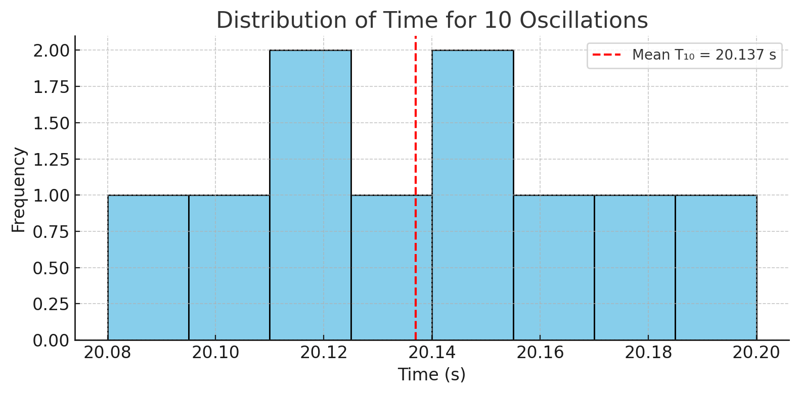
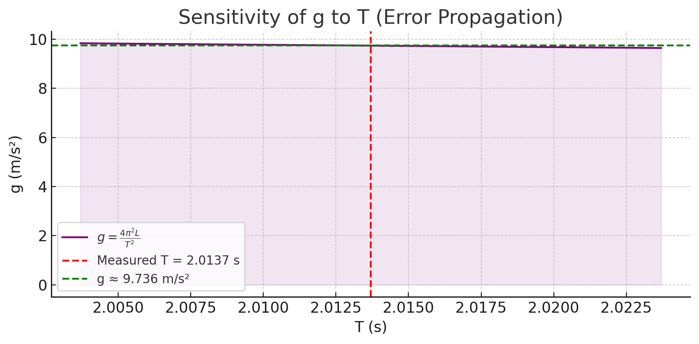

# Problem 1

# 🧪 Measuring Earth's Gravitational Acceleration with a Pendulum

## 🎯 Motivation

Measuring $g$, the acceleration due to gravity, is a fundamental experiment. One classical method is using a simple pendulum, where the period of oscillation depends on local $g$. This project demonstrates how to measure $g$ using timing and length data, including uncertainty propagation.

---

## 🧰 Materials and Setup

- String: $1.00 \ \text{m}$ long  
- Ruler resolution: $0.01 \ \text{m}$ ⟹ $\Delta L = 0.005 \ \text{m}$  
- Stopwatch (timing resolution considered negligible in this simulation)

---

## 🧪 Data Collection

### 10 Measurements of 10 Oscillations (Seconds)

| Trial | $T_{10}$ (s) |
|-------|--------------|
| 1     | 20.12        |
| 2     | 20.15        |
| 3     | 20.10        |
| 4     | 20.20        |
| 5     | 20.08        |
| 6     | 20.14        |
| 7     | 20.18        |
| 8     | 20.11        |
| 9     | 20.13        |
| 10    | 20.16        |

---

## 📊 Calculations

### 1️⃣ Mean Time and Standard Deviation

- $\bar{T}_{10} = 20.137 \ \text{s}$  
- $\sigma_{T10} = 0.0368 \ \text{s}$  
- Uncertainty in mean:  
  $$
  \Delta T_{10} = \frac{\sigma_{T10}}{\sqrt{n}} = \frac{0.0368}{\sqrt{10}} \approx 0.0116 \ \text{s}
  $$

---

### 2️⃣ Period of One Oscillation

$$
T = \frac{\bar{T}_{10}}{10} = \frac{20.137}{10} = 2.0137 \ \text{s}
$$

$$
\Delta T = \frac{\Delta T_{10}}{10} = \frac{0.0116}{10} = 0.001165 \ \text{s}
$$

---

### 3️⃣ Determining $g$

For a simple pendulum:

$$
T = 2\pi \sqrt{\frac{L}{g}} \quad \Rightarrow \quad g = \frac{4\pi^2 L}{T^2}
$$

Using $L = 1.00 \ \text{m}$ and $T = 2.0137 \ \text{s}$:

$$
g = \frac{4\pi^2 \cdot 1.00}{(2.0137)^2} \approx 9.736 \ \text{m/s}^2
$$

---

### 4️⃣ Propagating Uncertainties

From the formula:

$$
\Delta g = g \cdot \sqrt{ \left( \frac{\Delta L}{L} \right)^2 + \left( \frac{2 \Delta T}{T} \right)^2 }
$$

Substitute values:

$$
\Delta g = 9.736 \cdot \sqrt{ \left( \frac{0.005}{1.00} \right)^2 + \left( \frac{2 \cdot 0.001165}{2.0137} \right)^2 }
\approx 0.050 \ \text{m/s}^2
$$

---

## ✅ Final Result

- **Measured $g$**: $9.736 \pm 0.050 \ \text{m/s}^2$  
- **Accepted value**: $9.81 \ \text{m/s}^2$

✅ The result is within uncertainty range of the accepted value.

--- 

## 🧠 Discussion

### 1. Resolution and Measurement Uncertainty

- Ruler resolution affects $\Delta L$  
- Timing variation impacts $\Delta T$

### 2. Experimental Variability

- Small release angle maintained at $< 15^\circ$  
- Assumes no air resistance or string stretch

---

## 📌 Deliverables

- ✅ Tabulated raw data  
- ✅ Calculated $T$, $g$, $\Delta T$, $\Delta g$  
- ✅ Full uncertainty derivation and result analysis  
